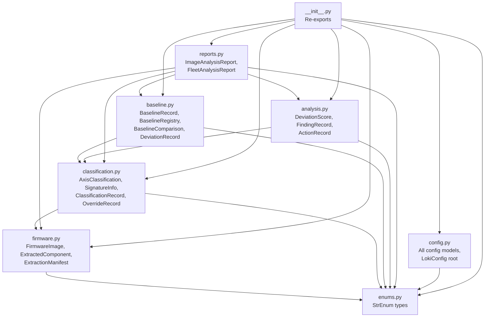

# Design: LOKI Data Models

## Overview

This design defines the complete Pydantic v2 data model layer for the LOKI firmware analysis platform. The models package (`loki/models/`) provides the shared type system consumed by every subsystem — CLI, extraction, classification, baseline management (GLEIPNIR), and analysis/reporting.

The design prioritizes:
- Strict validation on construction (fail-fast on bad data)
- JSON and YAML round-trip serialization without data loss
- A strict import DAG (no circular dependencies)
- Deterministic ID generation where applicable (e.g., image_id from file_hash)
- Composability — higher-level models reference lower-level ones by embedding, not by ID-only foreign keys

### Key Research Findings

- Pydantic v2 `ConfigDict(strict=True)` enforces type coercion rules at construction time, rejecting e.g. `int` where `str` is expected. This is the right default for a data-integrity-focused model layer.
- `StrEnum` (Python 3.11+) serializes to plain strings in JSON, which is ideal for human-readable output and YAML compatibility.
- Pydantic v2 validators (`@field_validator`, `@model_validator`) run at construction time and can enforce cross-field constraints (e.g., composite_confidence = min of axis confidences).
- For YAML support, `model_dump()` produces a plain dict that `pyyaml.safe_dump()` can serialize directly. No custom serializer needed.
- `uuid5` with a LOKI-specific namespace UUID provides deterministic ID generation from file hashes.

## Architecture

### Module Dependency DAG



Arrows indicate "imports from". The DAG is acyclic by construction: each layer only imports from layers above it.

### Design Decisions

1. **Embedding over foreign keys**: Composite models (e.g., `ExtractionManifest`) embed full sub-models rather than referencing by ID. This makes each model self-contained for serialization and avoids the need for a lookup layer at the model level.

2. **`frozen=False`**: Models are mutable by default per the requirements (`ConfigDict(frozen=False)`). This allows in-place updates (e.g., adding overrides to a ClassificationRecord) without needing to reconstruct the entire object.

3. **Deterministic `image_id`**: Uses `uuid5(LOKI_NAMESPACE, file_hash)` so the same firmware binary always gets the same ID, enabling deduplication and caching.

4. **Auto-computed fields**: `composite_confidence` and `needs_review` on `ClassificationRecord` are computed via `@model_validator(mode='after')` so they stay consistent even if axis confidences are updated.

5. **Semver as string**: `baseline_version` is stored as a plain string with regex validation rather than a custom type, keeping the model layer dependency-free beyond Pydantic and stdlib.

## Components and Interfaces

### Module: `enums.py`

All `StrEnum` types used across the model layer.

| Enum | Values | Used By |
|------|--------|---------|
| `ComponentTypeLabel` | Domain-specific labels (e.g., UEFI_DRIVER, BOOTLOADER, OS_KERNEL, ...) | classification.py |
| `VendorLabel` | Vendor identifiers | classification.py |
| `SecurityPostureLabel` | SECURE, VULNERABLE, UNKNOWN | classification.py |
| `MutabilityLabel` | READONLY, MUTABLE, UNKNOWN | classification.py |
| `ClassificationMethod` | SIGNATURE, RULE, HEURISTIC | classification.py |
| `DeltaType` | ADDED, REMOVED, MODIFIED, RECLASSIFIED, UNCHANGED | baseline.py |
| `SeverityLevel` | CRITICAL, HIGH, MEDIUM, LOW, INFO | analysis.py, reports.py |
| `PostureRating` | COMPROMISED, AT_RISK, DEGRADED, BASELINE, HARDENED | reports.py |
| `SecurityDirection` | DEGRADED, UNCHANGED, IMPROVED | analysis.py |
| `SignatureDelta` | LOST, GAINED, CHANGED, NONE | analysis.py |
| `MutabilityChange` | BECAME_MUTABLE, BECAME_READONLY, NONE | analysis.py |
| `OutputFormat` | HUMAN, JSON, YAML | config.py |
| `ColorMode` | AUTO, ALWAYS, NEVER | config.py |
| `LogLevel` | DEBUG, INFO, WARN, ERROR | config.py |

### Module: `firmware.py`


**Public interfaces:**

- `FirmwareImage` — Core identity model for a firmware binary.
  - Constructor: all fields except `image_id` and `extraction_timestamp`
  - `image_id`: auto-generated via `uuid5(LOKI_NAMESPACE, file_hash)` if not provided
  - Validator: `file_hash` must be exactly 64 lowercase hex characters
  - Validator: `file_size` must be > 0

- `ExtractedComponent` — Single extracted component from a firmware image.
  - Validator: `offset` must match `^0x[0-9a-fA-F]+$`
  - Validator: `raw_hash` must be 64 hex chars

- `ExtractionManifest` — Container for a full extraction run.
  - `total_components`: auto-computed as `len(components)` via model validator
  - `extraction_errors`: list of `ExtractionError` (simple model: component_id, error_message, timestamp)

### Module: `classification.py`

**Public interfaces:**

- `AxisClassification` — Single axis result with label, confidence, method.
  - Validator: `confidence` in `[0.0, 1.0]`

- `SignatureInfo` — Code-signing metadata for a component.

- `OverrideRecord` — Analyst override of a classification axis.
  - Validator: `justification` must be non-empty

- `ClassificationRecord` — Full classification output for one component.
  - Contains four `AxisClassification` fields: `type_axis`, `vendor_axis`, `security_axis`, `mutability_axis`
  - `composite_confidence`: auto-computed as `min(axis.confidence for axis in axes)`
  - `needs_review`: auto-set to `True` if `composite_confidence < 0.60`

### Module: `baseline.py`

**Public interfaces:**

- `BaselineRecord` — A named baseline snapshot.
  - Validator: `baseline_version` matches semver pattern `^\d+\.\d+\.\d+$`
  - `component_manifest`: list of `ClassificationRecord`

- `BaselineRegistry` — Container with lookup methods.
  - `get_by_id(baseline_id: UUID) -> BaselineRecord | None`
  - `get_by_vendor_model(vendor: str, model: str) -> list[BaselineRecord]`
  - `get_by_vendor_model_version(vendor: str, model: str, version: str) -> BaselineRecord | None`

- `DeviationRecord` — Single deviation between baseline and target.

- `BaselineComparison` — Full comparison result.
  - `summary`: auto-computed counts by `DeltaType`

### Module: `analysis.py`

**Public interfaces:**

- `DeviationScore` — Composite risk score for a deviation.
  - Validator: `composite_score` in `[0.0, 10.0]`
  - Validator: `priority_rank` >= 1

- `FindingRecord` — A single analysis finding.
  - `evidence`: structured sub-model with classification_record ref, matched_rule, matched_cve, matched_signature, raw_indicators

- `ActionRecord` — Recommended remediation action linked to a finding.

### Module: `reports.py`

**Public interfaces:**

- `ImageAnalysisReport` — Full report for a single firmware image.
  - Embeds: `FirmwareImage`, list of `FindingRecord`, list of `ActionRecord`, optional `BaselineComparison`
  - `summary`: auto-computed component counts + finding counts by severity

- `FleetAnalysisReport` — Aggregate report across multiple images.
  - `fleet_posture`: dict of `PostureRating` to count
  - `common_findings`, `outlier_images`, `systemic_risks`: lists

### Module: `config.py`

**Public interfaces:**

- `GeneralConfig`, `ExtractionConfig`, `ClassificationConfig`, `AnalysisConfig`, `BaselineConfig`, `FeedsConfig`, `FleetConfig` — Individual config sections.
  - `AnalysisConfig.severity_weights`: validator ensures values sum to 1.0

- `LokiConfig` — Root config composing all sub-configs.
  - `@classmethod from_yaml(path: Path) -> LokiConfig`: loads and validates from YAML file

### Module: `__init__.py`

Re-exports all public models and enums. Consumers import via:
```python
from loki.models import FirmwareImage, ClassificationRecord, LokiConfig
```

## Data Models

### Shared Conventions

All models share:
```python
model_config = ConfigDict(strict=True, frozen=False)
```

- `UUID` fields serialize to string, deserialize from string
- `datetime` fields serialize to ISO-8601 string
- `StrEnum` fields serialize to plain string values

### LOKI Namespace UUID

```python
LOKI_NAMESPACE = uuid.UUID("a1b2c3d4-e5f6-7890-abcd-ef1234567890")
```

Used for deterministic `uuid5` generation.

### Model Definitions

#### `FirmwareImage`

| Field | Type | Constraints | Default |
|-------|------|-------------|---------|
| image_id | UUID | auto from file_hash via uuid5 | computed |
| file_path | str | required | — |
| file_hash | str | 64 hex chars, lowercase | — |
| file_size | int | > 0 | — |
| vendor | str \| None | — | None |
| model | str \| None | — | None |
| firmware_version | str \| None | — | None |
| extraction_timestamp | datetime \| None | ISO-8601 | None |

#### `ExtractedComponent`

| Field | Type | Constraints | Default |
|-------|------|-------------|---------|
| component_id | UUID | required | — |
| source_image_id | UUID | required | — |
| offset | str | `^0x[0-9a-fA-F]+$` | — |
| size | int | > 0 | — |
| raw_hash | str | 64 hex chars | — |
| component_type_hint | str \| None | — | None |
| guid | str \| None | — | None |
| name | str \| None | — | None |
| raw_path | str \| None | — | None |

#### `ExtractionError`

| Field | Type | Constraints | Default |
|-------|------|-------------|---------|
| component_id | UUID \| None | — | None |
| error_message | str | non-empty | — |
| timestamp | datetime | ISO-8601 | — |

#### `ExtractionManifest`

| Field | Type | Constraints | Default |
|-------|------|-------------|---------|
| source_image | FirmwareImage | required | — |
| components | list[ExtractedComponent] | required | — |
| extraction_timestamp | datetime | ISO-8601 | — |
| extractor_version | str | required | — |
| total_components | int | auto = len(components) | computed |
| extraction_errors | list[ExtractionError] | — | [] |

#### `AxisClassification`

| Field | Type | Constraints | Default |
|-------|------|-------------|---------|
| label | StrEnum | required | — |
| confidence | float | [0.0, 1.0] | — |
| method | ClassificationMethod | required | — |
| rule_id | str \| None | — | None |
| evidence | list[str] \| None | — | None |

#### `SignatureInfo`

| Field | Type | Constraints | Default |
|-------|------|-------------|---------|
| present | bool | required | — |
| verified | bool | required | — |
| signer | str \| None | — | None |
| cert_expiry | datetime \| None | ISO-8601 | None |

#### `OverrideRecord`

| Field | Type | Constraints | Default |
|-------|------|-------------|---------|
| original_label | str | required | — |
| override_label | str | required | — |
| analyst | str | required | — |
| timestamp | datetime | ISO-8601 | — |
| justification | str | non-empty | — |

#### `ClassificationRecord`

| Field | Type | Constraints | Default |
|-------|------|-------------|---------|
| component_id | UUID | required | — |
| source_image_id | UUID | required | — |
| extraction_offset | str | hex format | — |
| timestamp | datetime | ISO-8601 | — |
| type_axis | AxisClassification | required | — |
| vendor_axis | AxisClassification | required | — |
| security_axis | AxisClassification | required | — |
| mutability_axis | AxisClassification | required | — |
| signature_info | SignatureInfo \| None | — | None |
| cve_matches | list[str] | — | [] |
| suspicion_triggers | list[str] | — | [] |
| composite_confidence | float | auto = min(axes) | computed |
| needs_review | bool | auto = composite < 0.60 | computed |
| classification_version | str | required | — |
| overrides | list[OverrideRecord] | — | [] |

#### `BaselineRecord`

| Field | Type | Constraints | Default |
|-------|------|-------------|---------|
| baseline_id | UUID | required | — |
| name | str | required | — |
| vendor | str | required | — |
| model | str | required | — |
| firmware_version | str | required | — |
| created_timestamp | datetime | ISO-8601 | — |
| notes | str \| None | — | None |
| component_manifest | list[ClassificationRecord] | required | — |
| source_image_hash | str | 64 hex chars | — |
| baseline_version | str | `^\d+\.\d+\.\d+$` | — |

#### `BaselineRegistry`

| Field | Type | Constraints | Default |
|-------|------|-------------|---------|
| baselines | list[BaselineRecord] | — | [] |

Methods: `get_by_id`, `get_by_vendor_model`, `get_by_vendor_model_version`

#### `DeviationRecord`

| Field | Type | Constraints | Default |
|-------|------|-------------|---------|
| deviation_id | UUID | required | — |
| component_id | UUID | required | — |
| delta_type | DeltaType | required | — |
| baseline_state | ClassificationRecord \| None | — | None |
| target_state | ClassificationRecord \| None | — | None |
| description | str | required | — |

#### `BaselineComparison`

| Field | Type | Constraints | Default |
|-------|------|-------------|---------|
| baseline_id | UUID | required | — |
| target_image_id | UUID | required | — |
| comparison_timestamp | datetime | ISO-8601 | — |
| deviations | list[DeviationRecord] | required | — |
| summary | dict[DeltaType, int] | auto-computed | computed |

#### `DeviationScore`

| Field | Type | Constraints | Default |
|-------|------|-------------|---------|
| base_severity | SeverityLevel | required | — |
| component_criticality | float | [0.0, 1.0] | — |
| security_direction | SecurityDirection | required | — |
| signature_delta | SignatureDelta | required | — |
| cve_introduced | bool | required | — |
| mutability_change | MutabilityChange | required | — |
| composite_score | float | [0.0, 10.0] | — |
| priority_rank | int | >= 1 | — |

#### `FindingRecord`

| Field | Type | Constraints | Default |
|-------|------|-------------|---------|
| finding_id | UUID | required | — |
| component_id | UUID | required | — |
| severity | SeverityLevel | required | — |
| category | str | required | — |
| title | str | required | — |
| description | str | required | — |
| evidence | FindingEvidence | required | — |
| recommended_action | str | required | — |

#### `FindingEvidence`

| Field | Type | Constraints | Default |
|-------|------|-------------|---------|
| classification_record | ClassificationRecord \| None | — | None |
| matched_rule | str \| None | — | None |
| matched_cve | str \| None | — | None |
| matched_signature | str \| None | — | None |
| raw_indicators | list[str] | — | [] |

#### `ActionRecord`

| Field | Type | Constraints | Default |
|-------|------|-------------|---------|
| action_id | UUID | required | — |
| finding_id | UUID | required | — |
| action_type | str | required | — |
| description | str | required | — |
| reference | str \| None | — | None |

#### `ImageAnalysisReport`

| Field | Type | Constraints | Default |
|-------|------|-------------|---------|
| report_id | UUID | required | — |
| timestamp | datetime | ISO-8601 | — |
| analysis_version | str | required | — |
| image_id | UUID | required | — |
| image_metadata | FirmwareImage | required | — |
| posture_rating | PostureRating | required | — |
| summary | ReportSummary | auto-computed | computed |
| findings | list[FindingRecord] | required | — |
| recommended_actions | list[ActionRecord] | — | [] |
| baseline_comparison | BaselineComparison \| None | — | None |

#### `ReportSummary`

| Field | Type | Constraints | Default |
|-------|------|-------------|---------|
| total_components | int | >= 0 | — |
| findings_by_severity | dict[SeverityLevel, int] | — | — |

#### `FleetAnalysisReport`

| Field | Type | Constraints | Default |
|-------|------|-------------|---------|
| report_id | UUID | required | — |
| timestamp | datetime | ISO-8601 | — |
| fleet_id | str | required | — |
| image_count | int | >= 0 | — |
| fleet_posture | dict[PostureRating, int] | — | — |
| common_findings | list[FindingRecord] | — | [] |
| outlier_images | list[UUID] | — | [] |
| systemic_risks | list[str] | — | [] |
| recommended_actions | list[ActionRecord] | — | [] |

#### Config Models

**`GeneralConfig`**: default_output_format (OutputFormat), color (ColorMode), verbosity (int >= 0), log_level (LogLevel)

**`ExtractionConfig`**: default_output_dir (str), max_component_size (int > 0), timeout_per_component (int > 0)

**`ClassificationConfig`**: taxonomy_version (str), confidence_threshold (float [0.0, 1.0]), rules_path (str)

**`AnalysisConfig`**: severity_weights (dict[str, float], must sum to 1.0), default_severity_threshold (SeverityLevel), report_template (str | None)

**`BaselineConfig`**: storage_path (str), auto_match (bool)

**`FeedsConfig`**: nvd_url (str), update_interval (int > 0), cache_path (str), implant_rules_path (str)

**`FleetConfig`**: default_severity_threshold (SeverityLevel), storage_path (str)

**`LokiConfig`**: general (GeneralConfig), extraction (ExtractionConfig), classification (ClassificationConfig), analysis (AnalysisConfig), baseline (BaselineConfig), feeds (FeedsConfig), fleet (FleetConfig). Class method: `from_yaml(path: Path) -> LokiConfig`.


## Correctness Properties

*A property is a characteristic or behavior that should hold true across all valid executions of a system — essentially, a formal statement about what the system should do. Properties serve as the bridge between human-readable specifications and machine-verifiable correctness guarantees.*

### Property 1: JSON Serialization Round-Trip

*For any* valid model instance of any LOKI model type, serializing to JSON via `model_dump_json()` and deserializing back via `model_validate_json()` should produce an object equal to the original.

**Validates: Requirements 1.1, 2.1, 2.2, 3.1, 3.2, 3.3, 4.1, 4.2, 5.1, 5.2, 5.3, 5.4, 6.1, 6.3**

### Property 2: YAML Serialization Round-Trip

*For any* valid model instance of any LOKI model type, serializing to a dict via `model_dump()`, dumping to YAML via `yaml.safe_dump()`, loading back via `yaml.safe_load()`, and validating via `model_validate()` should produce an object equal to the original.

**Validates: Requirements 1.1, 2.1, 2.2, 3.1, 3.2, 3.3, 4.1, 4.2, 5.1, 5.2, 5.3, 5.4, 6.1, 6.3**

### Property 3: Deterministic Image ID Generation

*For any* valid SHA-256 hash string, constructing a `FirmwareImage` without providing an `image_id` should always produce `image_id == uuid5(LOKI_NAMESPACE, file_hash)`, and constructing two `FirmwareImage` instances with the same `file_hash` should always produce the same `image_id`.

**Validates: Requirements 1.1, 1.2**

### Property 4: SHA-256 Hash Format Validation

*For any* string that is not exactly 64 lowercase hexadecimal characters, constructing a `FirmwareImage` or `ExtractedComponent` with that string as `file_hash` or `raw_hash` should raise a `ValidationError`.

**Validates: Requirements 1.3, 2.1**

### Property 5: Bounded Float Validation

*For any* float value outside `[0.0, 1.0]`, constructing an `AxisClassification` with that value as `confidence` should raise a `ValidationError`. Similarly, *for any* float outside `[0.0, 10.0]`, constructing a `DeviationScore` with that value as `composite_score` should raise a `ValidationError`.

**Validates: Requirements 3.2, 5.1**

### Property 6: ClassificationRecord Computed Fields Invariant

*For any* valid `ClassificationRecord` with four axis classifications, `composite_confidence` should equal the minimum of all four axis confidence values, and `needs_review` should be `True` if and only if `composite_confidence < 0.60`.

**Validates: Requirements 3.3, 3.4**

### Property 7: ExtractionManifest Component Count Invariant

*For any* valid `ExtractionManifest`, `total_components` should always equal `len(components)`.

**Validates: Requirements 2.2**

### Property 8: BaselineComparison Summary Invariant

*For any* valid `BaselineComparison` with a list of `DeviationRecord` entries, the `summary` dict should contain a count for each `DeltaType` that exactly matches the number of deviations with that delta type in the `deviations` list.

**Validates: Requirements 4.3**

### Property 9: BaselineRegistry Lookup Correctness

*For any* `BaselineRegistry` containing a set of `BaselineRecord` entries, `get_by_id(id)` should return the record with that `baseline_id` if it exists (else `None`), `get_by_vendor_model(v, m)` should return exactly the records matching both vendor and model, and `get_by_vendor_model_version(v, m, ver)` should return the single record matching all three fields (else `None`).

**Validates: Requirements 4.2**

### Property 10: ImageAnalysisReport Summary Invariant

*For any* valid `ImageAnalysisReport`, `summary.findings_by_severity` should contain counts that exactly match the severity distribution of the `findings` list.

**Validates: Requirements 5.3**

### Property 11: Severity Weights Sum Validation

*For any* dict of severity weights where the values do not sum to `1.0` (within floating-point tolerance), constructing an `AnalysisConfig` with those weights should raise a `ValidationError`.

**Validates: Requirements 6.1**

## Error Handling

### Validation Errors

All models use Pydantic v2's built-in validation. Invalid data raises `pydantic.ValidationError` with structured error details including:
- Field path (e.g., `type_axis.confidence`)
- Error type (e.g., `value_error`, `string_pattern_mismatch`)
- Human-readable message

### Specific Error Scenarios

| Scenario | Behavior |
|----------|----------|
| Invalid SHA-256 hash (wrong length, non-hex) | `ValidationError` on `FirmwareImage.file_hash`, `ExtractedComponent.raw_hash`, `BaselineRecord.source_image_hash` |
| Confidence outside [0.0, 1.0] | `ValidationError` on `AxisClassification.confidence` |
| Composite score outside [0.0, 10.0] | `ValidationError` on `DeviationScore.composite_score` |
| Invalid semver string | `ValidationError` on `BaselineRecord.baseline_version` |
| Empty justification on override | `ValidationError` on `OverrideRecord.justification` |
| Severity weights not summing to 1.0 | `ValidationError` on `AnalysisConfig.severity_weights` |
| Invalid hex offset format | `ValidationError` on `ExtractedComponent.offset` |
| Invalid YAML file for LokiConfig | `ValidationError` or `FileNotFoundError` / `yaml.YAMLError` propagated with context |

### Error Propagation Strategy

- Model-level validation errors are not caught internally — they propagate to the caller.
- `LokiConfig.from_yaml()` wraps file I/O errors with a descriptive message but lets `ValidationError` propagate directly.
- No silent defaults for required fields — all required fields must be explicitly provided.

## Testing Strategy

### Property-Based Testing

**Library**: [Hypothesis](https://hypothesis.readthedocs.io/) (Python's standard PBT library)

**Configuration**:
- Minimum 100 examples per property test (`@settings(max_examples=100)`)
- Each test tagged with: `# Feature: loki-data-models, Property {N}: {title}`
- Custom Hypothesis strategies for generating valid model instances (registered via `st.register_type_strategy` or built with `st.builds`)

**Generators needed**:
- `valid_sha256()` — generates 64-char lowercase hex strings
- `valid_hex_offset()` — generates `0x`-prefixed hex strings
- `valid_semver()` — generates `X.Y.Z` strings
- `valid_firmware_image()` — builds `FirmwareImage` with valid fields
- `valid_extracted_component()` — builds `ExtractedComponent` with valid fields
- `valid_axis_classification()` — builds `AxisClassification` with random enum + confidence in [0,1]
- `valid_classification_record()` — composes four axis classifications
- `valid_baseline_record()` — builds with valid semver and component manifest
- `valid_deviation_record()` — builds with random DeltaType
- And so on for each model type

**Property tests** (one test per property from Correctness Properties section):
1. JSON round-trip for each model type
2. YAML round-trip for each model type
3. Deterministic image_id from file_hash
4. Invalid hash rejection
5. Out-of-range confidence/score rejection
6. ClassificationRecord computed fields
7. ExtractionManifest total_components
8. BaselineComparison summary counts
9. BaselineRegistry lookup correctness
10. ImageAnalysisReport summary counts
11. Invalid severity weights rejection

### Unit Tests (Example-Based)

- Valid construction of each model with representative data
- `LokiConfig.from_yaml()` with a valid YAML fixture file
- `BaselineRegistry` edge cases: empty registry, duplicate vendor+model
- `OverrideRecord` with empty/whitespace justification
- Enum serialization: each enum value serializes to its string name

### Smoke Tests

- Import `from loki.models import *` succeeds without circular import errors
- All public models are accessible from `loki.models`

### Integration Tests

- `LokiConfig.from_yaml()` reads an actual YAML file from disk and produces a valid config
- End-to-end: construct a full `ImageAnalysisReport` from nested sub-models, serialize to JSON, write to file, read back, deserialize, verify equality
